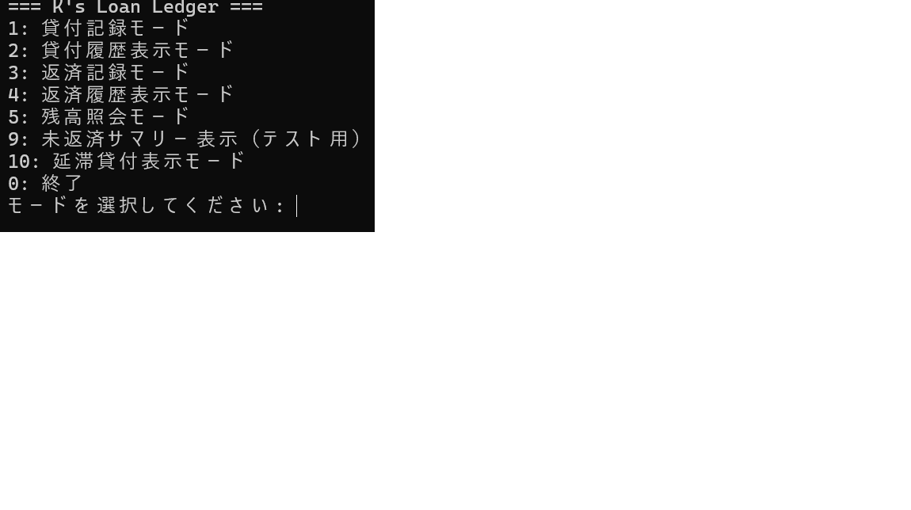

# K’s Loan Ledger

小規模事業・少人数チーム向け  
**貸付・返済・未回収を履歴と状態で管理する業務管理ツール**

K’s Loan Ledger は、Excel やスプレッドシートで属人化しがちな
貸付・回収業務を、**履歴・状態・集計**の観点から整理・可視化するための
業務向け管理ツールです。

現状：CLI（業務ロジック確立フェーズ） → 将来：Web UI + Deploy（Eシリーズ）

---

## プロダクト背景

小規模事業やチーム内では、以下のような金銭管理が日常的に発生します。

- 立替・貸付の発生
- 返済予定の管理
- 未回収・延滞の把握
- 回収状況の共有・引き継ぎ

これらを Excel やスプレッドシートで管理している場合、

- 返済状況が時系列で追いづらい
- 未回収・延滞の見落としが起きやすい
- 管理方法が属人化し、監査性・再現性が低い

といった課題が生じやすくなります。

K’s Loan Ledger は、こうした業務を **「履歴」と「状態」** を軸に整理し、
正確に把握できる状態を作ることを目的としています。

---

## 想定ユーザー

- 小規模事業者（経理・業務担当）・個人事業主
- スタートアップや少人数チームのバックオフィス担当
- 業務管理・業務改善を外注したい非エンジニア

---

## 解決する課題

1. **未回収・延滞の見落とし**
2. **返済・入金履歴を時系列で追えない問題**
3. **管理手法の属人化による引き継ぎ・監査の難しさ**

---

## 主な機能（現状）

- 貸付記録の登録・履歴表示
- 返済記録の登録・履歴表示
- 貸付残高の照会
- 未返済サマリーの表示
- 延滞貸付の抽出・表示
- 契約解除の登録・管理

※ 現時点では CLI ツールとして実装されています。

## CLI 実行例（抜粋）
### 貸付登録
python main.py
→ 1: 貸付記録モード を選択

---

## Design Policy

### 1. Design Philosophy（設計思想）

`k_loan_ledger` は、貸付・返済・残高・監査（証跡）という業務ドメインを **CLI + CSV** で再現した小規模システムです。

クラウドソーシング案件応募向けポートフォリオとして、以下を優先して設計しています。

- **拡張性**：DB化・Web化（Flask等）への移行を見据え、責務と境界を固定する
- **実務っぽさ**：起動時健全化（データ修復/検証）、ログ/監査の分離、操作証跡を残す設計を含める

### 境界（責務分離）

- `main.py`：CLI の I/O とフロー制御（メニュー、入力、表示、例外ハンドリング）
- `modules/`：業務ルールと判断（ドメインロジック）
- `data/`：永続化ストレージ（CSV）
- CSV の読み書き・パス解決・入力補助は `utils.py` に集約し、他モジュールの依存を減らす

### 起動パスの分離（軽量サマリ）

`--summary` 実行は「重い import を避けて」最小依存で動作します（CSV行数のみ表示）。  
通常起動では domain 層（modules）を読み込み、各モード機能を提供します。

### ログと監査の二層化

- `logger.py`：技術者向け実行ログ（デバッグ/障害解析）。`data/app.log` に INFO/ERROR を出力
- `audit.py`：監査ログ（証跡）。操作（mode遷移/起動終了/エラー等）を `data/audit_log.csv` に記録


### 2. Public API（main.py が依存する “窓口”）

> ルール：`main.py` から呼ばれている関数は、CLIの安定動作を支える **公開契約（Public API）** として扱います。  
> Docstring はまずこの範囲を優先して整備します。

### modules/customer_module.py
- `list_customers()`
- `search_customer(keyword)`
- `get_all_customer_ids()`
- `get_credit_limit(customer_id)`

### modules/loan_module.py
- `register_loan(...)`
- `display_loan_history(customer_id, filepath=...)`
- `display_repayment_history(customer_id, filepath=...)`
- `display_unpaid_loans(customer_id, filter_mode, loan_file, repayment_file, today)`
- `register_repayment_complete(loans_file, repayments_file, loan_id, amount, repayment_date, actor)`
- `cancel_contract(loans_file, loan_id, reason, operator)`

### modules/balance_module.py
- `display_balance(customer_id)`

### modules/logger.py / modules/audit.py
- `get_logger(name)`
- `append_audit(action, target_type, target_id, meta, actor=...)`

### modules/utils.py（横断基盤：main が直接利用）
- `get_project_paths()`
- `clean_header_if_quoted(path)`
- `validate_schema(path, required_columns)`
- `normalize_customer_id()`, `normalize_method()`, `fmt_date()`
- `prompt_customer_id()`, `prompt_method()`, `prompt_int()`, `prompt_float()`, `prompt_date_or_today()`


### 3. Module Responsibilities（モジュール責務定義）

> モジュールは「何をするか」ではなく  
> **“何に責任を持ち、何をやらないか”** を明確にします。

### `modules/loan_module.py`（中核ドメイン）
**責務**：貸付・返済・未返済/延滞・契約状態など、貸付ドメインの判断を担う。  
**やること**：登録/保存、履歴取得、未返済/延滞判定、契約解除などの業務ロジック  
**やらないこと**：CLI入出力、パス解決、ログ設定

### `modules/customer_module.py`（顧客マスタ）
**責務**：`customers.csv` を扱う（参照・検索・上限取得など）。  
**やらないこと**：残高計算、延滞判定（他責務）

### `modules/balance_module.py`（照会）
**責務**：貸付・返済を突合し、顧客単位の残高を算出する。  
**やらないこと**：貸付/返済の登録処理

### `modules/utils.py`（共通基盤）
**責務**：CSV I/O、パス、入力補助、正規化、スキーマ検証など横断処理。  
**やらないこと**：ドメイン固有の判断（延滞/残高など）

### `modules/logger.py`（技術ログ）
**責務**：実行ログ（開発・運用向け）を出力する。  
**出力先**：`data/app.log`

### `modules/audit.py`（監査ログ）
**責務**：業務操作の証跡を記録し、後追い検証・集計可能にする。  
**出力先**：`data/audit_log.csv`


### 4. Naming Conventions（命名規則）

- PEP8 に準拠（snake_case / CapWords）
- 関数は **動詞 + 目的語**（例：`register_loan`, `display_unpaid_loans`, `cancel_contract`）
- 金額/日数など **単位を含める**（例：`late_fee_rate_percent`, `grace_period_days`）
- `*_file` / `*_path` は型と意味を一致させる（文字列パスか `Path` かを揃える）


### 5. Docstring & Comment Policy（Docstring / コメント方針）

### Docstring の目的
- **API契約（入力・出力・例外・副作用）を明文化**し、CLIからの呼び出しを安定させる
- 将来の UI/保存先変更（CSV→DB）で破壊的変更を避ける

### Docstring を必須にする対象
**main.py から直接呼ばれる “Public API” は必須**（上の一覧）。  
内部ヘルパーは複雑な場合のみ記述します。

### コメントの目的
- コメントは **Why（なぜ）** を書く
- What（何をしているか）はコードで表現する

### Docstring テンプレ（簡易 Google style）
```python
def display_unpaid_loans(customer_id: str, filter_mode: str, loan_file: str, repayment_file: str, today: date):
    """Show unpaid loans for a customer.

    Args:
        customer_id: Normalized customer identifier.
        filter_mode: "all" or "overdue".
        loan_file: Path to loan CSV.
        repayment_file: Path to repayment CSV.
        today: Reference date used for overdue judgment.

    Returns:
        list[dict] | None: Depends on implementation (document actual behavior).

    Raises:
        ValueError: For invalid inputs (document actual behavior).
    """
```

---

## 非機能要件　Non-Functional Requirements (NFR)

本プロダクト（K's Loan Ledger）は、**ローカルCLI + CSV運用**を前提とした個人向け管理ツールである。
そのため、機能要件に加えて「データが失われない」「操作履歴を追跡できる」「誤操作に強い」ことを
非機能要件として明確に定義する。

---

### 1. Data Durability（データ消失対策）※最優先

**前提**
- 正データ（Single Source of Truth）は `data/*.csv`
- データ更新は原則 **追記（append）** 方式

**要件**
- CSVデータの消失・破損リスクを最小化する
- 万一破損した場合でも、直近の正常状態へ復旧可能であること

#### Backup Policy（運用ルール）

- CSVへの書き込み前に、必ずバックアップを作成する
- バックアップは repo 配下の `backup/` ディレクトリに保存する
- バックアップは操作単位で取得し、世代管理を行う
- `backup/` は Git 管理対象外とする

**構成例**
backup/
├─ 2026-01-28_loan_v3.csv.bak
├─ 2026-01-28_repayments.csv.bak
└─ 2026-01-28_customers.csv.bak


**世代管理**
- 最新 N 世代（例：10世代）を保持
- 超過分は古いものから削除

**復旧手順**
1. 破損したCSVを退避
2. `backup/` から直近の正常バックアップを `data/` に復元
3. アプリケーションを再実行し整合性を確認

---

### 2. Validation & Data Integrity（バリデーション方針）

**目的**
- CSVが正データである以上、不正レコードの混入を防止する
- 特に追記運用では、1行の不整合が全体の信頼性を破壊するため、入力段階での防止を重視する

#### 入力時バリデーション（CLI）

- 必須項目の未入力を禁止
- 金額は正の数のみ許可
- 日付は ISO形式（YYYY-MM-DD）に統一
- 列挙値（例：payment_type）は定義済みの値のみ許可

#### 整合性バリデーション（参照整合性）

- `repayments.csv` は `loan_id` を主キー参照として扱う
- `loan_id` が `loan_v3.csv` に存在しない返済データは登録不可
- `customer_id` は補助キーとして扱い、loan側の `customer_id` と一致することを検証する
- 同一条件での二重登録を防止する

---

### 3. Logging（操作ログ設計）

**目的**
- 操作履歴を残し、原因調査・復旧・説明可能性を確保する

**前提**
- ローカルCLI前提のためユーザー識別は行わない
- 「いつ・何をしたか」を中心に記録する

**出力先**
- `data/app.log`（追記形式）

**記録内容**
- 実行日時（ISO形式）
- 実行モード / 操作種別
- 対象ID（loan_id / customer_id）
- 変更量（例：repayment_amount）
- 実行結果（SUCCESS / ERROR）
- エラーメッセージ（必要最小限）

---

### 4. Auditability（監査性・追跡可能性）

**目的**
- 任意のローンについて、発生から返済までの履歴を追跡可能とする

**追跡キー**
- `loan_id` を主キーとして扱う
- 以下のCSVを `loan_id` で横断的に追跡可能であること
  - `loan_v3.csv`（契約情報）
  - `repayments.csv`（返済履歴）

**期待される説明可能性**
- 任意の `loan_id` に対し、
  - いつ契約されたか
  - どの返済が行われたか
  - 現在の状態がどうなっているか
をCSVおよびログから説明できる

---

### 5. Security（ローカルCLI前提）

**前提**
- ネットワーク非公開
- 単一ユーザー利用を想定

**最低限の対策**
- `data/` 配下のCSVを不要に出力・共有しない
- ログには個人情報を過剰に記録しない（ID中心）
- 取消・無効化などの破壊的操作には確認ステップを設ける

---

### NFR Summary

本プロダクトは、  
**追記運用 + バックアップ + バリデーション + 操作ログ** を組み合わせることで、  
ローカルCLI環境においてもデータの信頼性・復旧性・説明可能性を確保している。


---

## 技術スタック（現状）

- Python
- CSV（データ永続化）
- pytest（テスト）

---

## Tech Stack Rationale（技術選定理由）

本プロジェクトは「最短で業務ロジックを正しく作り、テストで保証し、段階的に拡張できる状態を作る」ことを優先しています。 
これは、受託開発・業務ツール開発において「まず正確に動くこと」を最優先する設計判断です。
そのため、現状は **Python / CLI / CSV** を採用し、DB・Web化は後段（Eシリーズ）で実施します。

### 判断の優先順位（本プロジェクトの評価軸）
1. **業務ロジックの正確性と検証可能性（テストで保証できること）**
2. **開発速度と変更容易性（最短で動く形にし、改修に耐えること）**
3. **運用コストと導入容易性（小規模環境で導入しやすいこと）**

---

### なぜ CSV なのか（現状の永続化として）
CSV は、現フェーズにおいて「導入が軽く、内容が可視で、ロジック検証に集中できる」永続化方式です。

- **導入コストが低い**：DB セットアップ不要で、小規模環境でもすぐ運用に入れる
- **可視性が高い**：データが人間にも読め、仕様確認やデバッグが容易（監査性にも寄与）
- **ロジック設計に集中できる**：まずは「履歴・状態・集計」という中核価値を固めるのが目的

※ データ量や利用形態の変化に応じて、Eシリーズで SQLite / SQLAlchemy へ移行する前提です。

---

### なぜ CLI なのか（UIとしての選択）
CLI は「UI 実装に時間を使わず、業務ロジックとデータ設計を先に固める」ための選択です。

- **最短で動く業務ツールを構築できる**
- **UI とロジックの分離を徹底しやすい**
- **pytest によるロジック検証と相性が良い**

将来的な Web UI 化を前提に、表示層に依存しない構成を優先しています。

---

### なぜ DB 化・Web 化を後段に置くのか
DB 化・Web 化は利便性を高めますが、現時点で実施すると  
「業務ロジックの完成度」よりも「画面・認証・運用設計」に工数が寄りやすくなります。

本プロジェクトでは以下の順序を採用しています。

- **Dシリーズ（現フェーズ）**  
  CSV / CLI により、貸付・返済・状態管理・集計ロジックを完成度高く固める
- **Eシリーズ（次フェーズ）**  
  Web UI・DB・認証・可視化・デプロイを追加し、Web サービスとして提供

---

### Web 化・DB 化へ進むトリガー
以下の条件を満たした時点で、Eシリーズへ移行します。

- **同時利用が 2 人以上となり、Web UI による共有・操作が有効になる**
- Dシリーズの DoD を満たし、業務ロジックがテストで十分に保証されている

このように、段階的に技術を積み上げることで  
「小さく確実に作り、必要に応じて拡張する」設計判断を明確にしています。

---

## 今後のロードマップ（Eシリーズ）

本プロジェクトは、以下の拡張を計画しています。

- Flask による Web UI 化
- SQLite / SQLAlchemy による DB 化
- ログイン・セッション管理
- ダッシュボードによる可視化
- クラウド環境へのデプロイ

**最終的には URL を送るだけで、採用者・発注者が操作して理解できる
Web サービス化を目指しています。**

---

## このリポジトリについて

本リポジトリは、  
業務管理ツールの設計・実装・段階的拡張のプロセスを示す
ポートフォリオとして公開しています。


- OS: Windows 11 / PowerShell

- Python: 3.13.3

- テスト: pytest（22 passed）


## TL;DR（最短クイックスタート）


```powershell

# 1) 取得

git clone <YOUR\_REPO\_URL>

cd <YOUR\_REPO\_DIR>


# 2) 仮想環境

python -m venv .venv

. .\\.venv\\Scripts\\Activate.ps1


# 3) 依存

pip install -r requirements.txt


# 4) （任意）デモデータ投入

# ある場合のみ: python .\\scripts\\seed\_demo\_data.py


# 5) 実行

python .\\main.py

```


備考: 初回で requirements.txt が無い場合は


pip install pytest → pip freeze > requirements.txt で生成できます。

## メニュー（python main.py 実行時）


```text

1: 貸付記録モード

2: 貸付履歴表示モード

3: 返済記録モード

4: 返済履歴表示モード

5: 残高照会モード

9: 未返済サマリー表示（テスト用）

10: 延滞貸付表示モード

0: 終了

```


## ファイル構成（抜粋）

```text

<repo>/

&nbsp; main.py

&nbsp; modules/

&nbsp;   loan\_module.py

&nbsp;   ...（他のモジュール）

&nbsp; scripts/

&nbsp;   seed\_demo\_data.py

&nbsp; data/

&nbsp;   loan_v3.csv

&nbsp;   repayments.csv

&nbsp; tests/

&nbsp;   fixtures/

&nbsp;   audit\_test.py

&nbsp;   c1\_loan\_smoke.py

&nbsp;   c1\_utils\_smoke.py

&nbsp;   check\_loans\_csv\_schema.py

&nbsp;   list\_test.py

&nbsp;   repay\_audit\_test.py

&nbsp;   smoke\_c4.py

&nbsp;   test\_balance.py

&nbsp;   test\_c4.py

&nbsp;   test\_c5.py

&nbsp;   test\_enum\_round.py

&nbsp;   test\_late\_fee.py

&nbsp;   test\_overpayment.py

&nbsp;   test\_seed\_flow.py

&nbsp;   ...（他）

&nbsp; requirements.txt

```


## セットアップ（詳細）


```powershell

python -m venv .venv

. .\\.venv\\Scripts\\Activate.ps1

pip install -r requirements.txt

```


実行ポリシーで怒られたら一時的に：


```powershell

Set-ExecutionPolicy -Scope Process -ExecutionPolicy Bypass

. .\\.venv\\Scripts\\Activate.ps1

```


## 使い方（CLI版）

基本


```powershell

python .\\main.py

```

よく使う操作

- 未返済サマリー（テスト用）：メニューで \[9]

- 延滞のみ表示：メニューで \[10]

- 返済登録：メニューで \[3] → loan\_id / 返済額 / 日付 を入力

- 残高照会：メニューで \[5]

将来的にサブコマンド直叩き（例：python main.py add\_loan ...）を実装したら追記予定。


## テスト（pytest）

```powershell

pytest -q

# 詳細/絞り込み

pytest -q --maxfail=1 -k <keyword>

```

- 期待結果：22 passed

- 主な観点：

&nbsp;   - CSVスキーマ整合（check\_loans\_csv\_schema.py）

&nbsp;   - 延滞手数料（test\_late\_fee.py）

&nbsp;   - 過剰返済ガード（test\_overpayment.py）

&nbsp;   - 残高計算（test\_balance.py）

&nbsp;   - シード/スモーク（test\_seed\_flow.py, smoke\_c4.py ほか）


## スクリーンショット / 出力例


### 画面イメージ

- メニュー画面  



- 未返済サマリー（メニュー \[9]）  


- 延滞一覧（メニュー \[10]）  


### テキスト出力例

```text

\[UNPAID] loan\_id=LN-001, principal=10000, due=2025-11-15, status=OVERDUE(+3d), late\_fee=300

\[UNPAID] loan\_id=LN-002, principal=8000,  due=2025-11-20, status=DUE(–2d),   late\_fee=0

```


```text

\[REPAYMENT ADDED] loan\_id=LN-001, amount=5000, date=2025-11-05

\[REPAYMENT TOTAL] paid=5000 / expected=11000 → remaining=6000

```


### 返済登録後の計算例


```text

\[REPAYMENT ADDED] loan\_id=LN-001, amount=5000, date=2025-11-05

\[REPAYMENT TOTAL] paid=5000 / expected=11000 → remaining=6000

```


画像版スクショは docs/images/ などに配置して README から参照。


データと注意点

- 保存：data/\*.csv（UTF-8）

- バックアップ推奨：data/ は .gitignore で除外し、.gitkeep でディレクトリ維持

- 同時編集注意：Excel等で同時開きは不可（排他制御なし）


